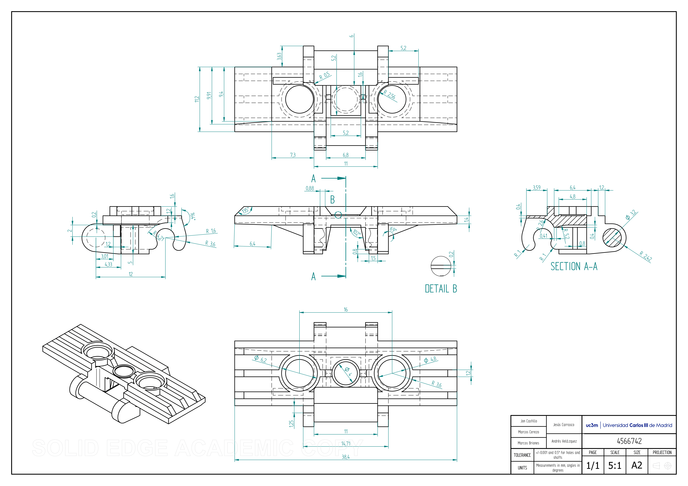
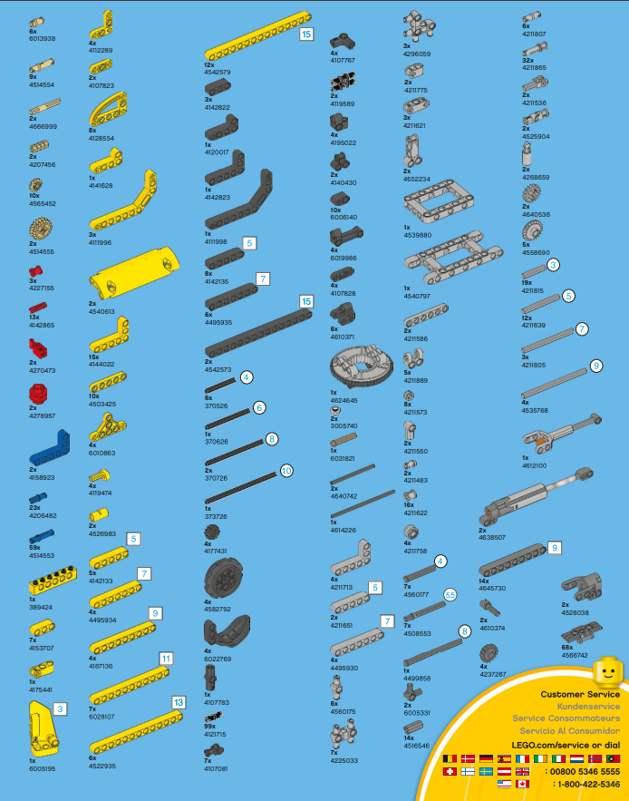

# 🌌 LEGO Technic 42006 Excavator Project

Welcome to our university project on the LEGO Technic 42006 Excavator, modeled in Solid Edge and converted to general-purpose formats for 3D printing and Blender. This repository contains all parts, assemblies, technical drawings, renders, and more, showcasing the skills in CAD modeling, 3D printing preparation, and visualization.

## 📑 Table of Contents
1. [Repository Structure](#-repository-structure)
2. [Project Overview](#-project-overview)
3. [Requirements](#%EF%B8%8F-requirements)
4. [Visuals](#-visuals)
5. [How to Use](#-how-to-use)
6. [Download as .zip](#-download-as-zip)
7. [Course Information](#-course-information)
8. [Contribution](#-contribution)
9. [License](#-license)

---

## 📁 Repository Structure

```
.
├── Parts/                 # All the individual pieces
├── Assembly/            # All the assemblies and subassemblies
├── Drafts/              # Technical drawings exported as PDFs
├── Renders/               # PNG/JPG images and MP4/GIF animations of the model
├── Composite_Parts/         # Pieces that contain multiple parts
├── Resources/
.
```
*Note*: Large files (`.par`, `.asm`, `.stl`, `.obj`, `.fbx`) are compressed in `PAR.zip`, `ASM.zip`, `STL.zip`, `OBJ.zip`, and `FBX.zip` due to GitHub’s file size limits. Download and unzip to use. Alternatively, access uncompressed files here.

## 🚀 Project Overview

The LEGO Technic 42006 Excavator is a complex mechanical model with a rotating cab, articulated arm, and functional bucket. This project focuses on:

- Design precise 3D models using Solid Edge.
- Generate technical drawings for engineering documentation.
- Export models to STL for 3D printing and OBJ/FBX for Blender.
- Create high-quality renders and animations.

Completed for Graphic Desing in Aerospace Engineering at University Carlos III of Madrid.

## Extensions

(`.3D`, `.3MF`, `.FBX`, `.IFC`, `.IGES`,`.JT`, `.OBJ`, `.PAR`, `.PDF`, `.SAT`, `.SEV`, `.STEP`, `.STL`, `.U3D`, `.X_B`,`.ASM`)

> [!IMPORTANT]
> The `.zip` for the `.asm` are sometimes called `PAR.zip`.

## 📋 Requirements

To use the files:

- **Solid Edge**: For `.par` and `.asm` files (version \[specify, e.g., ST10 or newer\]).
- **3D Printing**:
  - Use STL files with slicers like Cura or PrusaSlicer.
  - Recommended settings: 0.2mm layer height, PLA material.
- **Blender**: For OBJ/FBX files (Blender 3.0 or newer recommended).
- **PDF Viewer**: For technical drawings (e.g., Adobe Acrobat).
- **Image/Video Viewer**: For renders (PNG/JPG) and animations (MP4/GIF).

## 🖼️ Visuals

### Render of the LEGO Technic 42006 Excavator

<p align="center">
  
</p>

<p align="center">
  
</p>

<p align="center">
  
</p>

1. **Clone the Repository**:

   ```bash
   git clone https://github.com/Himalia/42006-Lego-Model.git
   ```

2. **Solid Edge**:

   - Open `.par` and `.asm` files in Solid Edge to explore/edit the models.

3. **3D Printing**:

   - Unzip `STL.zip` and import STL files into a slicer (e.g., Cura).
   - Adjust print settings based on your printer (e.g., infill, supports).

4. **Blender**:

   - Import OBJ/FBX files into Blender for visualization or animation.
   - Apply materials or animate assemblies as needed.

5. **Drawings and Documentation**:

   - View PDFs in `Drafts/` for technical details.


## 📦 Download as .zip
If you prefer, you can download the entire repository as a .zip file:

1. Visit the repository page in GitHub.
2. Click the green **Code** button.
3. Select **Download ZIP** and extract the contents to your local directory.


## 📘 Course Information

- **Institution**: Universidad Carlos III de Madrid (UC3M)
- **Program**: Aerospace Engineering
- **Course**: Graphic Desing
- **Academic Year**: 2023-2024

## 🤝 Contribution
Contributions are welcome. If you want to add or improve a simulation, create a pull request or open an issue to discuss it.

## 📄 License
This project is free to use, modify, and distribute without restrictions
