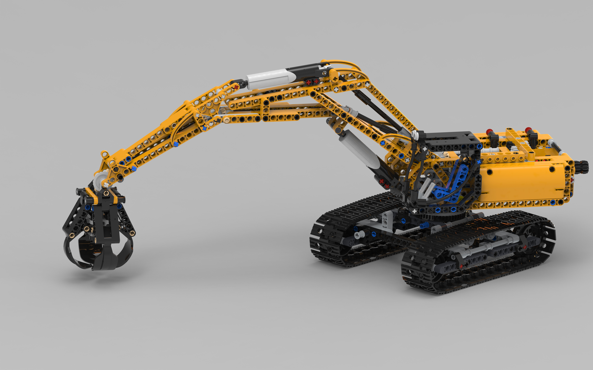
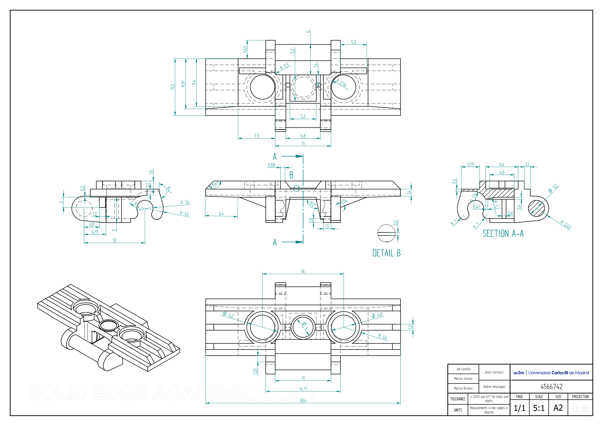

<!--
Licensed under the Creative Commons Attribution-NonCommercial 4.0 International License (CC BY-NC 4.0).
LEGO® is a registered trademark of the LEGO Group, which does not sponsor, authorize, or endorse this project.
-->

# Technic Excavator CAD Model

[](LICENSE.md)
[](https://www.uc3m.es/)
[](#requirements)
[](https://www.blender.org/)
[](https://github.com/Himalia13/42006-Lego-Model/stargazers)
[](https://github.com/Himalia13/42006-Lego-Model/commits/main)

<p align="center">
  
</p>

A complete, high-precision 3D CAD modeling project of the official **LEGO Technic 42006 Excavator** set. Developed as part of the *Graphic Design in Aerospace Engineering* curriculum at **Universidad Carlos III de Madrid (UC3M)**.

All individual components, subassemblies, composite parts, technical drawings, and converted formats (`.STL`, `.OBJ`, `.FBX`, `.STEP`, etc.) are organized natively in dedicated folders for seamless exploration, 3D printing, and Blender visualization.

---

### Quick Navigation

[**Project Overview**](#project-overview) |
[**Repository Structure**](#repository-structure) |
[**Downloads / Packages**](#downloads--packages) |
[**Supported Formats**](#supported-formats) |
[**Requirements & Software**](#requirements) |
[**Visual Showcase**](#visual-showcase) |
[**How to Use**](#how-to-use) |
[**Course Details**](#course-information) |
[**License & Disclaimer**](#license--disclaimer)

---

## Project Overview

The **LEGO Technic 42006 Excavator** features complex mechanical movements including a 360° rotating superstructure, an articulated boom/arm, and a functional four-prong grabber.

Key engineering objectives of this repository:
- **Precision Modeling:** Recreate every individual piece and mechanical linkage in **Solid Edge**.
- **Engineering Documentation:** Draft standardized technical drawings and dimensioned sheets (`Drafts/`).
- **3D Printing Readiness:** Export optimized mesh geometry for additive manufacturing slicers (`STL/`, `3MF/`).
- **Visualization & Animation:** Export clean models (`OBJ/`, `FBX/`) for lighting, texturing, and dynamic physics in **Blender**.

---

## Repository Structure

```
42006-Lego-Model/
├── Assembly/               # Subassemblies, each exported to every supported format
│   ├── ARM/                # 3D · 3MF · FBX · IFC · IGES · JT · OBJ · PAR · PDF · SAT · SEV · STEP · STL · U3D · X_B
│   ├── BODY/
│   ├── CABIN/
│   ├── CHAIN/
│   ├── HOOK/
│   └── TOTAL/              # Full excavator assembly
├── Composite_Parts/        # Multi-piece sub-assemblies (native Solid Edge .asm/.par)
│   ├── ClGray_4525904_AVV/
│   ├── Mtp_4612100_AVV/
│   ├── Mtp_4624645_JCA/
│   └── Mtp_4638507_AVV_andMore/
├── Parts/                  # Every individual LEGO piece, exported to every supported format
│   ├── 3D · 3MF · FBX · IFC · IGES · JT · OBJ · PAR · PDF · SAT · SEV · STEP · STL · U3D · X_B
├── Drafts/                 # Dimensioned technical engineering drawings (.pdf)
│   ├── ASSEMBY/             # Per-subassembly drawing sheets
│   ├── Composed_Parts/      # Drawings for composite parts
│   └── Parts/                # Drawings for individual parts
├── Renders/                 # Image renders and mounting animations
│   ├── Mountings/            # Assembly step animations (.mp4 / .wmv)
│   ├── Parts_Images/         # Individual part renders (.jpg)
│   └── Total.jpg             # Full-model hero render
├── Resources/                # Reference images and supporting assets
├── LICENSE.md
├── README.md
├── .gitattributes
└── .gitignore
```

---

## Downloads / Packages

For anyone who doesn't need the full repository, pre-zipped **STEP** packages are available so you can grab just the pieces or assemblies you need without pulling every export format.


### By Assembly (STEP)

| Assembly | Download |
|---|---|
| ARM | [ZIP](https://github.com/Himalia13/42006-Lego-Model/releases/latest/download/ARM_STEP.zip) |
| BODY | [ZIP](https://github.com/Himalia13/42006-Lego-Model/releases/latest/download/BODY_STEP.zip) |
| CABIN | [ZIP](https://github.com/Himalia13/42006-Lego-Model/releases/latest/download/CABIN_STEP.zip) |
| CHAIN | [ZIP](https://github.com/Himalia13/42006-Lego-Model/releases/latest/download/CHAIN_STEP.zip) |
| HOOK | [ZIP](https://github.com/Himalia13/42006-Lego-Model/releases/latest/download/HOOK_STEP.zip) |
| **TOTAL** (full model) | [ZIP](https://github.com/Himalia13/42006-Lego-Model/releases/latest/download/TOTAL_STEP.zip) |

### All Individual Parts (STEP)

| Package | Download |
|---|---|
| All parts, STEP format | [ZIP](https://github.com/Himalia13/42006-Lego-Model/releases/latest/download/Parts_STEP.zip) |


---

## Supported Formats

The repository includes native CAD files along with universal exchange formats:

`.PAR` • `.ASM` • `.STEP` • `.IGES` • `.STL` • `.3MF` • `.OBJ` • `.FBX` • `.PDF` • `.JT` • `.SAT` • `.U3D` • `.X_B` • `.IFC` • `.SEV`

---

## Requirements

To view, edit, or utilize the assets in this repository:

* **CAD Modeling & Editing:**
  * **Any CAD Software** (Fusion 360, SolidWorks, Inventor, FreeCAD, CATIA, etc.): You can open, edit, and inspect the model geometry using the universal `.STEP` and `.IGES` files.
  * **Siemens Solid Edge:** Required **only** if you wish to inspect or modify the original parametric feature tree, native constraints, or `.par` / `.asm` file structures.
* **3D Printing:** Any modern slicer (Bambu Studio, PrusaSlicer, Cura) accepting `.stl` or `.3mf` files.
* **Rendering & Animation:** Blender 3.0+ or any 3D software capable of importing `.obj` or `.fbx` formats.
* **Documentation:** Any standard PDF reader for files in `Drafts/`.

---

## Visual Showcase

### High-Resolution Render
<p align="center">
  
</p>

### Technical Engineering Drawing
<p align="center">
  
</p>

---

## How to Use

### 1. Clone the Repository

```
git clone https://github.com/Himalia13/42006-Lego-Model.git
```

Or, if you just need a subset of files, grab a package from [**Downloads / Packages**](#downloads--packages) instead of cloning the whole repo.

### 2. Cloning Only the Folders You Need

If you don't want the whole repository (renders, drafts, and every export format add up fast), use Git's **sparse-checkout** to clone only the folders you're interested in:

```bash
# 1. Clone without checking out any files yet
git clone --no-checkout --filter=blob:none https://github.com/Himalia13/42006-Lego-Model.git
cd 42006-Lego-Model

# 2. Enable sparse-checkout in "cone" mode
git sparse-checkout init --cone

# 3. Pick the folder(s) you want (space-separated, add as many as you like)
git sparse-checkout set Assembly/ARM/STEP

# 4. Check out the files
git checkout main
```

Some useful examples:

| I want... | Command |
|---|---|
| Just the ARM assembly | `git sparse-checkout set Assembly/ARM` |
| Only STEP files for every part | `git sparse-checkout set Parts/STEP` |
| The final drafts/drawings | `git sparse-checkout set Drafts` |
| Renders only | `git sparse-checkout set Renders` |

You can change your mind later without re-cloning — just run `git sparse-checkout set <new-folders>` again, or `git sparse-checkout disable` to go back to a full checkout.

### 3. CAD Workflows
- **Universal CAD:** Import `.step` files from `Assembly/<PART>/STEP/` or `Parts/STEP/` into any CAD suite to edit geometry or create custom assemblies.
- **Solid Edge:** Open native `.asm` files located in `Assembly/` to edit parametric features and native assembly relationships directly via `Parts/` and `Composite_Parts/`.

### 4. Additive Manufacturing (3D Printing)
- Import `.stl` or `.3mf` files into your preferred slicer.


### 5. Rendering & Animation (Blender)
- Import `.obj` or `.fbx` files into Blender.

## Course Information
Institution: Universidad Carlos III de Madrid (UC3M)

Degree: Bachelor's Degree in Aerospace Engineering

Subject: Graphic Design

Academic Year: 2023–2024

## License & Disclaimer
This repository and its assets are licensed under the Creative Commons Attribution-NonCommercial 4.0 International License. See the full terms in the LICENSE.md file.

## Disclaimer
LEGO® is a registered trademark of the LEGO Group of companies, which does not sponsor, authorize, or endorse this repository. This project is an independent educational fan creation.